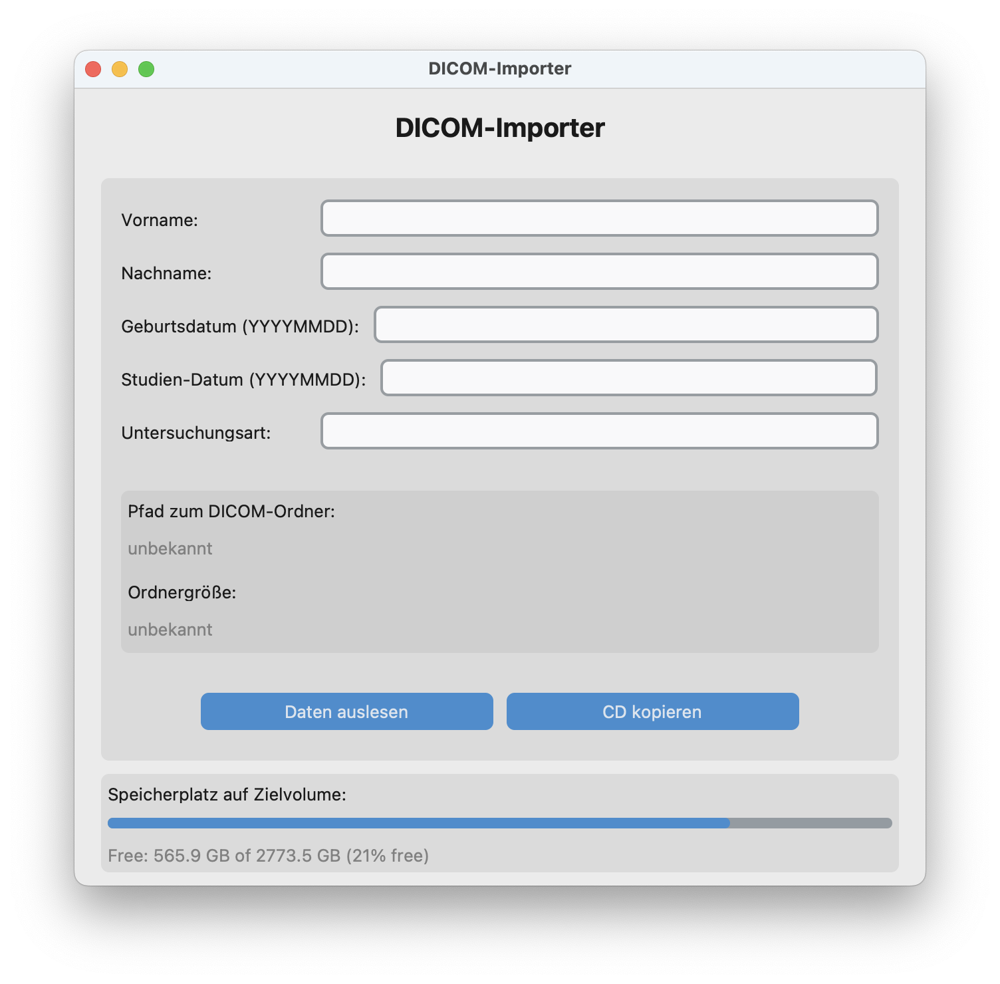

# DICOM-Importer

A macOS application to import DICOM data from CD-ROMs or folders and save them in a structured and human-readable format.

## Features

- Automatically detects DICOM folders (even nested)
- Extracts patient information (First name, Last name, DOB, Study date, Modality)
- Displays editable form fields for patient data
- Calculates folder size and available disk space
- Graphical progress bar with MB display during copying
- Allows cancellation of copy operation with cleanup
- Saves to a structured folder name like: `20240621-19800101-Smith, John-CT`

## Screenshots



## Installation

Requires Python 3.11+ and [pyinstaller](https://pyinstaller.org) (for building the app).

Clone the repository:

```bash
git clone https://github.com/sommeru/dicom-importer.git
cd dicom-importer
```


## Creating an `.icns` Icon from PNG

To convert the icon for macOS:

```bash
mkdir icon.iconset
sips -z 16 16     icon.png --out icon.iconset/icon_16x16.png
sips -z 32 32     icon.png --out icon.iconset/icon_16x16@2x.png
sips -z 32 32     icon.png --out icon.iconset/icon_32x32.png
sips -z 64 64     icon.png --out icon.iconset/icon_32x32@2x.png
sips -z 128 128   icon.png --out icon.iconset/icon_128x128.png
sips -z 256 256   icon.png --out icon.iconset/icon_128x128@2x.png
sips -z 256 256   icon.png --out icon.iconset/icon_256x256.png
sips -z 512 512   icon.png --out icon.iconset/icon_256x256@2x.png
sips -z 512 512   icon.png --out icon.iconset/icon_512x512.png
cp icon.png icon.iconset/icon_512x512@2x.png
iconutil -c icns icon.iconset
rm -r icon.iconset
```

Install dependencies (if any), then build the app:

```bash
pyinstaller --windowed --name "DICOM-Importer" --icon=icon.icns --add-data "icon.png:." main.py
```

The `.app` bundle will be created in the `dist/` folder.

## License

GNU3 License. © 2025 J. Ulrich Sommer
